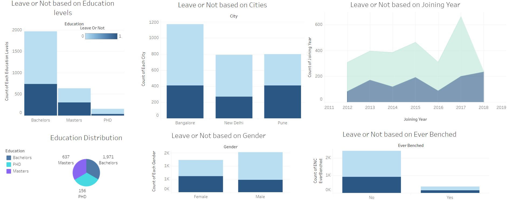

# Employee-Leave-Pattern-Analysis 

#### Dataset source : [Employee Dataset](https://www.kaggle.com/datasets/tawfikelmetwally/employee-dataset)

## Tools utilized : 
- IBM DB2
- IBM Data Studio Client
- Tableau

## Objective
<p align="justify">The primary objective is to analyze employee behavior and retention patterns using preprocessed data stored in SQL DB2 and visualized through Tableau. This project aims to uncover insights related to employee satisfaction, performance evaluations, and turnover trends. These insights will support organizations in developing data-driven strategies for improving employee engagement, optimizing workforce management, and minimizing attrition rates.</p>

## Preprocessing Data Using SQL

#### Drop duplicated data rows 
```
CREATE TABLE NEW_EMPLOYEE LIKE EMPLOYEE@
INSERT INTO NEW_EMPLOYEE(SELECT DISTINCT Education, 
    JoiningYear, City, PaymentTier, 
    Age, Gender, EverBenched, ExperienceInCurrentDomain, LeaveOrNot
FROM EMPLOYEE)@
```

<p align="justify">These line of SQL code was made to drop duplicated rows of data, in total of 1,889 duplicate rows, which can be proved from the code below.</p>

```
SELECT Education, 
    JoiningYear, City, PaymentTier, 
    Age, Gender, EverBenched, 
    ExperienceInCurrentDomain, LeaveOrNot, COUNT(*) AS total
FROM EMPLOYEE

GROUP BY Education, 
    JoiningYear, City, PaymentTier, 
    Age, Gender, EverBenched, ExperienceInCurrentDomain, LeaveOrNot
HAVING COUNT(*) > 1@
```

#### Encoding categorical data
```
-- GENDER var
UPDATE EMPLOYEE
SET ENC_GENDER = CASE
	WHEN GENDER = 'Male' THEN 1
	WHEN GENDER = 'Female' THEN 0
END@

-- CITY var
UPDATE EMPLOYEE
SET ENC_CITY = CASE
	WHEN CITY = 'Bangalore' THEN 0
	WHEN CITY = 'New Delhi' THEN 1
	WHEN CITY = 'Pune' THEN 2
END@

-- EDUCATION var
UPDATE EMPLOYEE
SET ENC_EDUCATION = CASE
	WHEN EDUCATION = 'Bachelors' THEN 0
	WHEN EDUCATION = 'Masters' THEN 1
	WHEN EDUCATION = 'PHD' THEN 2
END@

-- EVERBENCHED var
UPDATE EMPLOYEE 
SET ENC_EVERBENCHED = CASE
	WHEN EVERBENCHED = 'No' THEN 0
	WHEN EVERBENCHED = 'Yes' THEN 1
END@
```
Encoding categorical variables to numerics, to help analytics process or fitting data into predicting models.

#### Create a new variable to help analysis process
```
ALTER TABLE EMPLOYEE ADD YEARSINCOMPANY INTEGER@

UPDATE EMPLOYEE E
SET E.YEARSINCOMPANY = EXTRACT(YEAR FROM CURRENT DATE) - JOININGYEAR@
```
<p align="justify">Created a new variable Years In Company to help analyticals process through knowing how long has an employee worked for the company.</p>

## Tableau Dashboard Analysis

#### Dashboard link : [Tableau Dashboard](https://public.tableau.com/app/profile/cornelius.karel.halim/viz/Employee_Dashboard_17302271154610/Dashboard1?publish=yes)

- <p align="justify">Employees with a bachelor’s degree are more prone to leaving compared to those with higher education levels.</p>
- <p align="justify">Bangalore shows higher employee turnover than New Delhi or Pune.</p>
- <p align="justify">Peaks in employee departures occurred around 2017, indicating possible workforce restructuring or dissatisfaction.</p>
- <p align="justify">Both male and female employees show comparable attrition trends, suggesting gender-neutral workforce dynamics.</p>
- <p align="justify">Employees who were benched show higher attrition, emphasizing the need for better project allocation strategies.
</p>

## Conclusion 
<p align="justify">Analysis of employee data reveals important factors that influence workforce behavior and turnover. Key patterns include higher attrition among graduate degree holders and employees in Bangalore, as well as a correlation between bench status and the likelihood of quitting. Although gender differences are very small, tenure and city location also play an important role in employee retention dynamics. Understanding these trends helps organizations identify potential risks to workforce stability and proactively address employee dissatisfaction.</p>

## Recommendations based on analytic findings
<p align="justify">- Upskilling initiatives targeted specifically for college degree holders can increase engagement and reduce employee turnover. Offering advanced learning opportunities or promotions can encourage longer tenure.</p>
<p align="justify">- The high turnover rate in Bangalore may be due to external factors (e.g. competitive job market, living conditions). Companies could increase local employee support programs, such as housing assistance or transportation benefits, to retain talented employees.</p>
<p align="justify">- Employees who have experienced benching are more likely to resign. To reduce bench-related attrition, HR teams could optimize project allocation and assign meaningful temporary assignments to maintain employee motivation.</p>
<p align="justify">- Attrition trends by joining year highlight the importance of onboarding experiences. Regular feedback during the first few years of employment can enhance employee satisfaction and retention.</p>
<p align="justify">Since gender does not significantly impact attrition, efforts should focus on creating a supportive, inclusive work culture that equally nurtures all employees.</p>

## What's Next?
#### <p align="justify">This analysis offers valuable insights into employee behavior and turn over rate in a company, but it's just the beginning. To turn these findings into actionable outcomes, the next step is to continuously refine strategies and monitor their impact. Ongoing efforts will ensure that the organization stays agile and proactive in managing workforce dynamics. So what is next?</p>
<p align="justify">- Build predictive models using machine learning to forecast potential attrition.</p>
<p align="justify">- Implement real-time dashboards by keeping the metrics up-to-date for timely action.</p>
<p align="justify">- Expand data collection by incorporating new variables for deeper insights.</p>
<p align="justify">- Test pilot programs through Launch small-scale initiatives and evaluate their success.</p>
<p align="justify">- Monitor the impact by tracking progress and adapt strategies based on feedback.</p>
